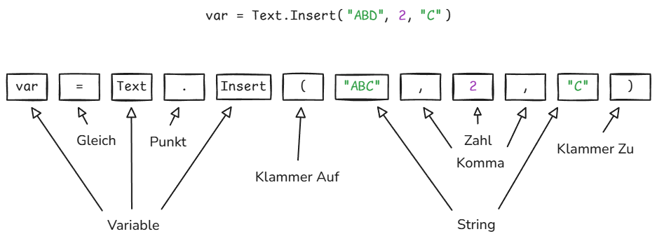
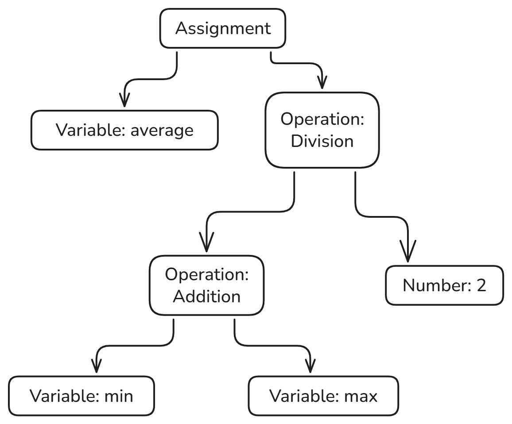

import Callout from '@/components/Callout.astro'
import LinkButton from '@/components/LinkButton.astro'
import { Icon } from 'astro-icon/components'

## Introduction

As a Data Analyst I often work with Data Transformation and Business Intelligence Solutions. I've been writing a lot of Power Query lately. Power Query is Microsoft's language for transforming data, and if you work with data in Excel or Power BI, you probably use it without thinking about it much. It's actually pretty good at what it does.

<Callout title="What is Power Query?" variant="explanation">
    To quote Microsofts Documentation:

    *Microsoft Power Query provides a powerful data import experience that encompasses many features. Power Query works with desktop Analysis Services, Excel, and Power BI workbooks, in addition to many online services, such as Fabric, Power BI service, Power Apps, Microsoft 365 Customer Insights, and more. A core capability of Power Query is to filter and combine, that is, to mash-up data from one or more of a rich collection of supported data sources. Any such data mashup is expressed using the Power Query M formula language. The M language is a functional, case sensitive language similar to F#.*

    For more info, please refer to [Power Query M formula language](https://learn.microsoft.com/en-us/powerquery-m/)

</Callout>

The problem is that sometimes I'll build something in Power Query and then realize I need to use it in Python. And when that happens, you're stuck. You can rewrite everything by hand, which takes forever. Or you can ask an LLM to convert it, which is faster but produces code that's wrong in subtle ways. The LLM will add functions you don't need, or miss important default behaviors, or just quietly skip steps it doesn't understand.

So I decided to write a converter that would translate Power Query to Python correctly. Not approximately correctly - actually correct, step by step, with the same output. This turned out to require building an interpreter, and I learned a lot about how interpreters work that I didn't know before.

<Callout title="PQC - PowerQueryConverter" variant="corollary">
  <LinkButton
    icon="lucide:github"
    variant="outline"
    class=""
    link="https://github.com/Marcel-TO/PQC-PowerQueryConverter"
    external={true}
  >
    Project Documentation
  </LinkButton>
</Callout>

## What is an Interpreter

Interpreters are strange things. They sit quietly in the background, and yet they determine how we experience programming languages. A compiler translates your program into something the machine understands. An interpreter is a program that runs other programs. That sounds circular, but it's not. When you write code in Python and hit run, something has to read that text, figure out what it means, and do it. That something is an interpreter.

The alternative to an interpreter is a compiler. A compiler translates your code into machine code before running it. Interpreters skip that step. They read your code and execute it directly, or translate it into some intermediate form that's easier to work with. Python actually does both - it compiles to bytecode and then interprets that - but for most purposes you can think of it as an interpreter.

The reason I needed to build an interpreter for Power Query was that I wasn't just trying to translate the syntax. Power Query has its own semantics - its own rules about what things mean. If you don't understand those rules, you'll get the translation wrong.

## How Interpreters Work

Interpreters generally work in stages. First you tokenize the source code, parse into a data structure that represents what it means. Then you execute that data structure.

First you have a lexer (Scanner or Tokenizer), which takes the raw text and breaks it into tokens - things like "keyword", "identifier", "number", "operator". Then you have a parser, which takes those tokens and builds a tree structure called an Abstract Syntax Tree, or **AST**.

The **AST** is a tree because code has structure. When you write `2 + 3 * 4`, that doesn't mean "do these operations left to right." It means "first multiply 3 and 4, then add 2 to the result." The multiplication is a subtree of the addition.

Once you have an **AST**, you can walk through it and execute each node. Or in my case, walk through it and generate Python code that does the same thing.

## Interpreter Foundation

### Lexer

When you build an interpreter, the first thing you have to do is break the input text into pieces. This step is called lexing, or sometimes scanning.

The input to a lexer is just a string of characters. The output is a list of tokens. A token is the smallest unit that means something - things like numbers, identifiers, operators, and keywords. So if you feed the lexer the text `x + 42`, it gives you back something like: `identifier "x"`, `plus operator`, `number 42`.

Why bother with this step? Why not just parse the raw text directly? Because it makes everything else simpler.

Parsing is hard enough without having to worry about the details of how text is represented. Should spaces matter? What about tabs? Can you break a line in the middle of a number? These are all questions the lexer answers once, so the parser doesn't have to think about them.

The lexer is also where you normalize things. Maybe your language allows numbers to be written as `1000` or `1_000` or `1,000`. The lexer converts all of these into the same internal representation. By the time the parser sees them, they're just numbers.

There's another advantage to lexing that's less obvious. Tokens are much easier to work with than raw characters. When you're parsing, you're constantly asking questions like "is the next thing a number?" or "is this an operator?" If you're working with characters, you have to check whether the next character is a digit, and if it is, keep reading until you get to something that isn't a digit. If you're working with tokens, you just check whether the next token is a number token. Much simpler.

The way lexers usually work is pretty straightforward. You scan through the input character by character. When you recognize the start of a token, you keep reading until you reach the end of it. Then you emit that token and start looking for the next one.

Some tokens are easy to recognize. If you see a `+`, that's a plus operator. Done. Others are trickier. If you see a digit, you have to keep reading to get the whole number. If you see a letter, it might be an identifier, or it might be a keyword like `if` or `else`. You have to read the whole word and then check whether it's a keyword.

The rules for what counts as a valid token are usually pretty simple. Numbers are sequences of digits, maybe with a decimal point. Identifiers are sequences of letters and numbers, starting with a letter. Operators are specific characters like `+` or `-` or `==`. These rules are so regular that you can often generate a lexer automatically from a description of the token types.

<Callout title="Lexing Example" variant="example">
    To make more sense of what I am referring to, let's analyse the following example:
    

    The Lexer tokenizes a Power Query Step `var = Text.Insert("ABD", 2, "C")` into multiple tokens:
    

        | Token | Literal |
        | ------- | ----- |
        | <Icon name="lucide:variable" /> Variable | var |
        | <Icon name="lucide:equal" /> Equal | = |
        | <Icon name="lucide:variable" /> Variable | Text |
        | <Icon name="lucide:dot" /> Dot | . |
        | <Icon name="lucide:variable" /> Variable | Insert |
        | <Icon name="lucide:parentheses" /> Parenthesis | ( |
        | <Icon name="lucide:case-upper" /> String | "ABD" |
        | <Icon name="lucide:table-columns-split" /> Colon | , |
        | <Icon name="lucide:hash" /> Integer | 2 |
        | <Icon name="lucide:table-columns-split" /> Colon | , |
        | <Icon name="lucide:case-upper" /> String | "C" |
        | <Icon name="lucide:parentheses" /> Parenthesis | ) |
    

</Callout>

What I learned from building my Power Query lexer was that the details matter more than you'd think. Power Query has some quirks. Identifiers can contain spaces if you put them in quotes marked with an `#` like `#"Rename Columns"`. There are different kinds of string literals with different escape rules. If you get any of these wrong, the lexer produces the wrong tokens, and everything downstream breaks.

The other thing I learned is that error handling starts at the lexer. If someone types @#$%, that's not a valid token in most languages. The lexer has to decide what to do. You could throw an error immediately. Or you could emit an error token and keep going, so you can find more errors in the same pass. What you can't do is ignore it, because then the parser will get confused.

Building a lexer isn't glamorous work. It's the kind of thing that seems boring until you try to do it, and then you realize there are all these details you didn't think about. But it's necessary. You can't build an interpreter without one. And once you have it working, everything else gets easier.

### Parser

Parsing is what happens after lexing. The lexer turns text into tokens. The parser turns tokens into a tree.

Why do we need a tree? As mentioned above in chapter [How Interpreters Work](#how-interpreters-work) code has structure. When you write `2 + 3 * 4`, you don't mean `(2 + 3) * 4`. You mean `2 + (3 * 4)`. The parser's job is to figure out which operations happen first and represent that as a tree where the things that happen first are deeper in the tree.

This tree is called an \***\***AST**\*\***, which stands for \***\*abstract syntax tree\*\***. It's abstract because it leaves out details that don't matter. It doesn't remember that you put extra spaces somewhere, or that you used parentheses when you didn't need to. It just remembers the structure.

The way parsers work is by following grammar rules. A grammar is basically a specification of what's legal in a language. It says things like "an expression can be a number, or two expressions added together, or two expressions multiplied together." The parser uses these rules to build up the tree.

There are different types of parsers. The main ones are called _LL_ parsers, _LR_ parsers, and _recursive descent_ parsers. The names sound intimidating but they just refer to different strategies for reading through the tokens.

An _LL_ parser reads from left to right and tries to predict what's coming next. When you see the start of an if statement, you know a condition is coming, then a block of code. An _LL_ parser makes these predictions and checks if they're right.

An _LR_ parser also reads left to right, but instead of predicting, it looks at what it's seen so far and tries to match it against patterns. When it sees `2 + 3`, it knows that's a complete expression and can reduce it to a single thing.

_Recursive descent_ parsers are simpler. They're basically just a function for each grammar rule, and the functions call each other. If you're parsing an if statement, you call the function that parses conditions, then the function that parses blocks. It's called recursive descent because you descend down through the grammar rules, and functions call themselves when the grammar is recursive.

Most production compilers use _LR_ parsers because they can handle more grammars. But recursive descent parsers are easier to write and understand, so they're common in teaching and in smaller projects. And honestly, for most programming languages, _recursive descent_ works fine.

The important thing about parsing isn't which algorithm you use. It's that you're converting a flat sequence of tokens into a structure that makes the relationships between parts of the code explicit. When you see `a = b + c`, the tree shows that `+` is an operation with `b` and `c` as operands, and `=` is an operation with `a` and the result of the addition as operands. The tree shows that the addition has to happen before the assignment.

This matters because all the later stages of compilation work on the tree, not the original text. When you're generating code or checking for errors, you need to know the structure. You need to know that the thing on the right side of `=` is an expression that needs to be evaluated before you can do the assignment.

One thing that surprised me when I first learned about parsing is how mechanical it is. I expected it to be complicated, but really it's just matching patterns. You have rules, and you follow them. The cleverness is all in how the rules are written, not in how they're applied.

The hardest part of parsing isn't writing the parser. It's designing a grammar that's unambiguous. You want the grammar to produce exactly one parse tree for any valid input. If the same input could be parsed in multiple ways, that's called ambiguity, and it's a problem because then you don't know what the code means.

This is why every programming language has rules about precedence and associativity. Precedence says that `*` binds tighter than `+`, so `2 + 3 * 4` means `2 + (3 * 4)`. Associativity says that `2 - 3 - 4` means `(2 - 3) - 4` and not `2 - (3 - 4)`. These rules eliminate ambiguity.

Some languages are harder to parse than others. Python is notoriously hard to parse because indentation is significant. You can't just look at tokens; you have to keep track of indentation levels. C++ is hard to parse because the same syntax can mean different things depending on context. Is `x * y` a multiplication or a pointer declaration? You can't tell without knowing what `x` is.

This is one reason new programming languages tend to have simpler syntax than old ones. The designers have learned that making parsing easy makes everything else easier too. If your language is easy to parse, it's easier to write tools for it. Easier to write syntax highlighters, code formatters, and compilers.

Parsing is one of those things that seems complicated when you first encounter it, but becomes simple once you understand it. It's just about converting a sequence into a tree according to rules. The sequences are token streams. The trees are **ASTs**. The rules are grammars. That's all there is to it.

### Abstract Syntax Trees (AST)

After you've turned your source code into tokens, you need to figure out what those tokens mean. This is where the Abstract Syntax Tree comes in.

An **AST** is a tree-shaped data structure that represents the structure of your program. Each node in the tree is a piece of syntax - an expression, a statement, a declaration. The tree structure captures how these pieces fit together.

Why is it called abstract you may ask? Because it leaves out details that don't matter for understanding what the program does. Things like parentheses and semicolons are there to help the parser, but once you've parsed the code, you don't need them anymore. The tree just captures the meaning.

Take the expression `(min + max) / 2` (as visualized below). The parentheses tell you to do the addition first. But once you've parsed this into a tree, you don't need the parentheses anymore. The tree itself encodes the order of operations. The division node has two children: the addition node and the number 2. That tells you everything you need to know.

The tree structure makes relationships explicit. In the text `(min + max) / 2`, the addition is nested inside the division because of the parentheses. In the tree, the addition node is literally a child of the division node. You can see the structure at a glance.

Building an **AST** is a two-step process. First you parse the tokens according to the grammar of your language. Then you build nodes for each syntactic construct you recognize.

The grammar tells you how the pieces fit together. It's a set of rules like "an expression can be a number, or an identifier, or an expression plus an expression." These rules define what's valid syntax and what isn't. And they tell you how to build the tree.

When you parse `var average = (min + max) / 2`, you build a tree with a variable declaration or assignment node at the root. That node has two children: the name "average" and the expression on the right side. The expression is itself a tree, with a division at the root, an addition on the left, and a number on the right.

Once you have an **AST**, you can do things with it. You can walk through it and execute each node. You can transform it to optimize the code. You can analyze it to find bugs. The tree structure makes all of this easier than working with the raw text or even the tokens.

This is why parsers produce **ASTs** rather than just saying "yes, this is valid syntax." The **AST** is the thing you actually want. It's the representation you'll work with for everything that comes after parsing.

**AST** sits between parsing and execution and the interpreter walks through it to run your code. If you're building a compiler, the code generator walks through it to produce machine code. If you're building an optimizer, you transform one **AST** into another, better **AST**.

Different languages have different **ASTs** because they have different syntax. But the basic idea is always the same: a tree that represents the structure of the code, abstracting away the details that don't matter.

When I was building my Power Query to Python converter, getting the **AST** right was crucial. Power Query has some weird syntax. Functions can be defined inline. Records use square brackets. Identifier Strings can start with an `#` and followed by a String value that contains spaces. The let expression lets you define a bunch of variables and then use them in a final expression. All of this has to be represented in the tree.

If the tree structure is wrong, everything downstream breaks. If you represent a let expression as a flat list of assignments instead of a nested structure, you won't get the scoping right. If you don't capture the fact that a function definition is an expression that produces a value, you'll generate the wrong Python code.

The **AST** has to capture not just what the code says, but what it means. And that's harder than it sounds, because the same syntax can mean different things in different contexts. In Power Query, `[x]` can be either a list with one element or a record access, depending on what comes before it. The **AST** has to make that distinction clear.

Building an **AST** by hand is tedious but not complicated. For each kind of syntax in your language, you define a node type. For each rule in your grammar, you write code that builds the right kind of node. Then you wire it all together so that parsing produces a tree.

Most of the time you don't actually build the parser by hand. You use a parser generator, which takes a grammar as input and produces code that parses that grammar. But you still have to design the **AST**, because the parser generator doesn't know what tree structure you want. It just knows how to recognize valid syntax.

The hard part isn't building the tree. It's designing it. You have to decide what nodes you need and how they should be connected. And you have to get this right, because everything else depends on it. If your **AST** doesn't capture the structure of the language accurately, your interpreter won't work.
