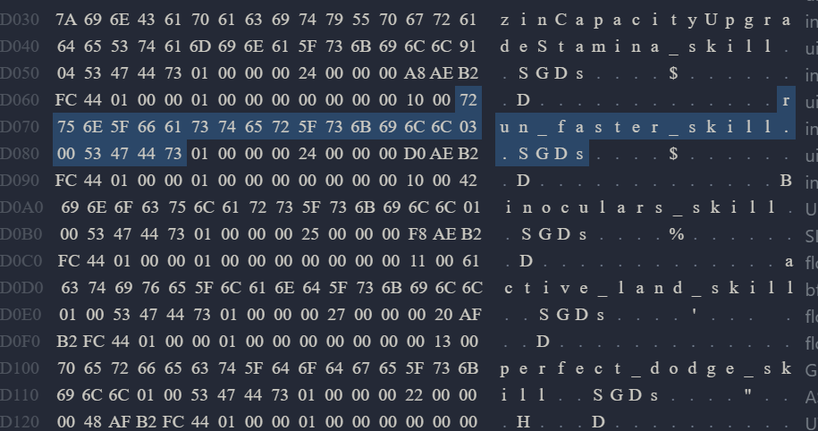
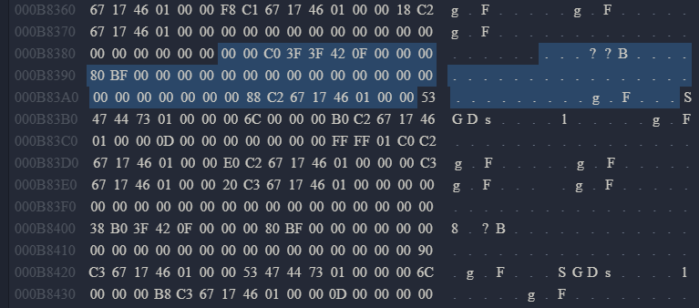

import Callout from '@/components/Callout.astro'

Welcome to Part II of my [Road to Save Editing | DL2](.) series. After the basics are now covered we can now jump into the interesting and fun parts. I will also show some code examples of types and other relevant parts from my [Save Editor](https://github.com/Marcel-TO/DL2_Save_Editor/) that is written in Rust (the backend/save analysis logic at least). If you are not familiar with this programming language do not be discouraged to continue. It is not required to understand the examples given. With this being said, let us dive in.

## How to Edit Skills

The first step is to locate where the Skills are positioned inside the savefile. After scrolling you will stumble accross a value called `Skills::SkillInstance` (Easiest way is to use `CTRL` + `F` to search for the string value). One thing to keep in mind when save editing is that the name displayed in the game is not the same as the value displayed inside the file. Thats because every item/skill uses it's ID for storing and not the display value.

In _DL2_ there are 2 different kinds of skills. The base skills and the legend skills. In terms of difference regarding save editing, the only difference you will find is that the ID starts with `LP_`. But I digress, first I want to focus on the base skills.

### Finding Skills

Each skill ID ends with `_skill`. Meaning the easiest way to find all skills would be to use regex for all matches. The following code example will showcase how I wrote the regex pattern to find all base skills. Since I only want to retrieve the base skills I need to exclude matches that start with `LP_`.

```rs showLineNumbers startLineNumber=452 {5-7} collapse={9-15}
fn find_base_skill_matches(content: &[u8]) -> Vec<String> {
    // Convert the byte data to string to check regex patterns.
    let string_data: String = String::from_utf8_lossy(content).to_string();
    // The Regex pattern to match base skills.
    let pattern: &str = r"([A-Za-z0-9_]+_skill)";
    // Defines the regex instance.
    let regex: Regex = Regex::new(pattern).expect("Failed to create regex");

    // Find all matches convert them to String and filter out all matches that start with LP_
    let matches: Vec<String> = regex
        .find_iter(&string_data)
        .map(|m| m.as_str().to_string())
        .filter(|s| !s.contains("LP_"))
        .collect();

    matches
}
```

Lets analyse the regex pattern: `([A-Za-z0-9_]+_skill)`

- It can contain all letters from A-Z in uppercase and lowercase.
- It can contain numbers from 0-9
- It can contain underscores `_`
- It ends with `_skill`.

Here are some examples of valid skills:

- _advanced_crouch_skill_
- _active_land2_skill_

As mentioned before the legend skills start with `LP_`. Knowing that you can adjust the regex pattern:

```rs showLineNumbers startLineNumber=477 del={5} ins={6} ins="legend"
fn find_legend_skill_matches(content: &[u8]) -> Vec<String> {
    // Convert the byte data to string to check regex patterns.
    let string_data: String = String::from_utf8_lossy(content).to_string();
    // The Regex pattern to match legend skills.
    let pattern: &str = r"([A-Za-z0-9_]+_skill)";
    let pattern: &str = r"(LP_[A-Za-z0-9_]+_skill)";
    // Defines the regex instance.
    let regex: Regex = Regex::new(pattern).expect("Failed to create regex");

    // Find all matches convert them to String.
    let matches: Vec<String> = regex
        .find_iter(&string_data)
        .map(|m| m.as_str().trim().to_string())
        .collect();

    matches
}
```

Now you have a regex pattern matcher for your legend skills.

### Find the Values

Great now we have the IDs for the skills, but what now? To get a better understanding, lets analyse the surrounding hex values:



The example highlights the ID `run_faster_skill`. Something you will see when digging more through such savefiles is an always reoccuring string **_SGDs_**. Basically each item/skill/element is followed by this string. Knowing that, a pattern emerges with every skill. First ID, then 2 bytes followed by SGDs. And here comes the great news. We do not have to search far for the skill values. Those 2 bytes represent the value multiplier of the Skill. Lets convert the 2 bytes `03 00` into a 16-bit integer, which results in 3. The default value is normally 1 (This value has already been manipulated, thats why it is not 1). In the game this is equivalent to a 3x running multiplier to your player character.

Let's say you want to run even faster. Take the 2 bytes and change them to your desired running multiplier. For example change them to `08 00` and boom you run way to fast for my personal taste.

## How to edit Inventory Items

While editing skills is fun and all, I know that you are not here for only the skills. Sadly I have to warn you. While editing skills was all fun and games so far, editing inventory items is quite complicated. But nothing you can't handle if you stick till the end. Here are the bytes where the inventory data starts: `4D 61 69 6E 01 00 00 00 05 00 4F 74 68 65 72`

### Inventory Item Data Structure

The complete data of a single item is split into 2 different sections. The first one contains information about level, seed, amount and durability. This part I like to call **_chunk_**. The second part contains information about the name/id of the item and about mods/transmog data. Lets call this part **_ID section_**. The weapon system of _DL2_ is quite interesting. You can not only use a variety of weapons but you can also modify them with weapon upgrades like shock or fire. This data is stored for each item.

#### ItemChunk

To better explain where you can find each property of an item chunk I want to showcase my struct itself:

```rs collapse={3-7} {10-14}
#[derive(Debug, Serialize, Deserialize, Clone)]
pub struct InventoryChunk {
    pub level: Vec<u8>,
    pub seed: Vec<u8>,
    pub amount: Vec<u8>,
    pub durability: Vec<u8>,
    pub counter_stats: Vec<u8>,
    pub space: Vec<u8>,
    pub index: usize,
    pub level_value: u16,
    pub seed_value: u16,
    pub amount_value: u32,
    pub durability_value: String,
    pub counter_stats_value: u32,
}
```

Before I am going to explain why there are more properties then previously mentioned, I want to point out the types of the ones I already pointed out. As you can see the `level` and `seed` value have an unsigned 16-bit integer type (2 bytes). The `amount` is stored as an unsigned 32-bit integer (4 bytes). With the `durability`, the type is a bit misleading. It is normally stored as a float, but due to convertion issues that occured between the backend and the frontend of the editor, I decided to store this value as a string. The only thing that is important to remember is that like the amount, the durability is also 4 bytes. Another parameter that was added by techland a few months ago is the `counter_stats` property. To be honest I do not know its proper usecase but it is important to know of its existence to calculate the proper offset. The index represents the offset of the chunk inside the savefile. Last but not least the `space` property. I chose to call it that way, because it is for our usecase a not relevant list of bytes between the properties and the starting offset.

Now the big question. How can I identify the chunk? Remember when I mentioned inside the skills chapter that each item/skill/element ends with `SGDs`? Well here is your identifier, only this time there is no ID in front of it. Just the `SGDs`. Here is an example:


To extract the properties it is now a matter of calculating the amount of bytes together.

<Callout title="Chunk Calculation" variant="solution">
Lets add them together:
```rs ins="+2" ins="+4" ins="+25"
level +2
seed +2
amount +4
durability +4
counter_stats +4
space +25
```

Great now we know that the data we need is 41 bytes long!

</Callout>

After starting from the `SGDs` identifier you can now move 41 bytes in front beginning from the starting point of the identifier.



The data is exactly stored in the same order as the calculation summary from above.

#### Inventory ID data part
The second part of an inventory item focuses on the ID and its mods/transmog data. This makes finding those a bit easier, since we can use a regex pattern again to find the

To be continued....
