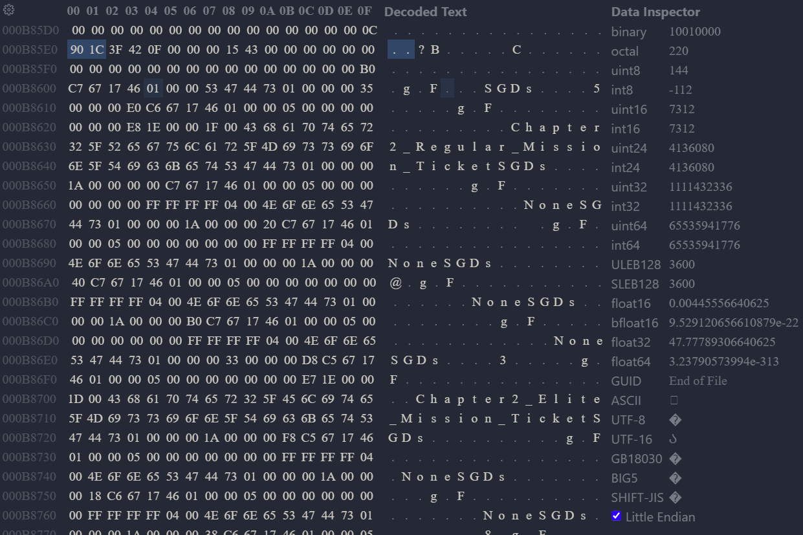

import Callout from '@/components/Callout.astro'

## Introduction

This blog documents my journey from the beginning of how I got started with save editing and learning its structures to creating an application for thousands of users. As you may know, I am the author of the Open Source [DL2 Save Editor](https://github.com/Marcel-TO/DL2_Save_Editor) for the video game ([Dying Light 2](https://dyinglightgame.com/dying-light-2/)), and it was a long and uneven road to automate the editing part and data manipulation. So, let's start at the beginning.

## What is Save Editing?

Let's assume you, the reader, are a gamer like myself. When playing your favorite game, you will probably stumble across a popup that says something like "Game has been saved" or "Progress saved." Did you ever wonder how it is being stored? In most cases, the progress will be stored in a save file somewhere in your game files. Depending on the development of the game, the file itself can come in various forms. Commonly used formats are `.json`, `.xml`, or `binary` files. Keep in mind that this is based on single-player games, since manipulating the game can lead to unfair advantages and should never be used in multiplayer games.

Those files hold information about the game state. For example, how much experience one has gained, what items are in the inventory, or what skills are unlocked. Changing them can manipulate the game and, depending on what you changed, lead to advantages inside the game. This process is commonly known as save editing.

As mentioned above, there is more than one way to store the game state. This blog does not focus on `.json` and `.xml` files since they are already very user-friendly and mostly self-explanatory, but also because [Dying Light 2](https://dyinglightgame.com/dying-light-2/) stores its content as binary.

## The Right Tools for the Job

Opening a save file with a text editor will get you nowhere. The content is pure gibberish. So how do I extract the information I need? The answer you are looking for is a **_Hex Editor_**.

<Callout title="Why Hex Editor?" variant="explanation">
    The content is stored in bytes. Bytes are not very readable. A Hex Editor
    converts the bytes into their corresponding hex values and structures the
    layout. On the left side, you will see the hex values, and on the right side, you
    will see the encoded string text. The following image shows an example of how
    an opened save file looks: 
</Callout>

### List of Hex Editors I Personally Used:

- [ImHex](https://github.com/WerWolv/ImHex)
- [HxD](https://mh-nexus.de/de/hxd/)
- [VS Code Extension](https://marketplace.visualstudio.com/items?itemName=ms-vscode.hexeditor)

### Encryption/Decryption

If you are planning to edit a PlayStation save, for example, keep in mind that in order to gain access to the save file itself, you need to decrypt your save. Please follow tutorials for either **_Save Wizard_** or **_PS Bots_**.

### Compression

Some saves, depending on their origin (PC saves in general or saves from **_PS Bot_**), compress the save file. In the case of **_DL2_**, the PC saves are compressed with gzip.

## Data Types

After everything is prepared in the previous chapter, we can now open the save file and unravel its content. Some snippets are readable, but there is no clue where to start now. Great. An important part of save editing is knowing what kind of data types are being used inside a save file. Two bytes can mean different things:

Let's analyze the highlighted hex values `90 1C` from the image. Those hex values represent the level number of one of the items (more regarding that later). As you can see, depending on what data type it represents in the game, the values are different.

| Variant | Usage |
| ------- | ----- |
|  Signed 8-bit integer (int8) | 1 byte - Range: $−128 \leq x \leq 127$ |
| Unsigned 8-bit integer (uint8) | 1 byte -  Range: $0 \leq x \leq 255$ |
| Signed 16-bit integer (int16) | 2 bytes - Range: $−32,768 \leq x \leq 32,767$ |
| Unsigned 16-bit integer (uint16) | 2 bytes - Range: $0 \leq x \leq 65,535$ |
| Signed 32-bit integer (int32) | 4 bytes - Range: $−2,147,483,648 \leq x \leq 2,147,483,647$ |
| Unsigned 32-bit integer (uint32) | 4 bytes - Range: $0 \leq x \leq 4,294,967,295$ |
| Signed 64-bit integer (int64) | 8 bytes - Range: $−9,223,372,036,854,775,808 \leq x \leq 9,223,372,036,854,775,807$ |
| Unsigned 64-bit integer (uint64) | 8 bytes - Range: $0 \leq x \leq 18,446,744,073,709,551,615$ |
| Float (32-bit, IEEE 754) | 4 bytes - Represents real numbers (with decimals). |
| Little Endian | Stores the least significant byte first (lowest memory address). Example (32-bit value `0x12345678`): stored as `78 56 34 12`. |
| Big Endian | Stores the most significant byte first (lowest memory address). Example (32-bit value `0x12345678`): stored as `12 34 56 78`. |

### Understanding the Relation Between Byte Values and Game Values

Due to the value displayed in the game, you can rule out certain byte values. For example, if an item has a value that only goes up to 255, you know that it is only storing 1 byte (8-bit integer). If it is more, then it uses 2 bytes (16-bit integer), and so on.
It is a little bit different when it comes to float values. In Dying Light games, for example, the durability of a weapon is stored as a float due to perks, skills, and charms that affect durability as well.

In Dying Light 2, each item contains 4 important attribute values: **_Level, seed, amount, and durability_**. Durability is self-explanatory; it represents the durability of a certain item. Amount is also obvious; it represents how much of a certain item the player is carrying. The seed is used for generating the stats of an item. Each seed generates a specific stat pattern. The level represents the level of the item. In the game, you see levels from 0-13, but it is stored as an unsigned 16-bit integer.

<Callout variant="axiom">
    The level itself affects the seed. This means the same seed does not cause the
    same result if there are different levels involved.
</Callout>

## Conclusion
In the last few chapters, we established the foundation of what save editing is and what it brings, what data types are being used, and how to differentiate them. Building on top of this knowledge, I want you to follow me even deeper into the matter. My next subposts will contain detailed examples on where you can find items and attributes, skills, and much more—the whole data structure I managed to unravel.

## Special Thanks

But before that, I want to address something first. Most of what you are reading is not something I learned by myself. ***@zCaazual*** shared his findings with me and helped me understand what happens inside save files. Without him, I would have never managed to build what I did.
