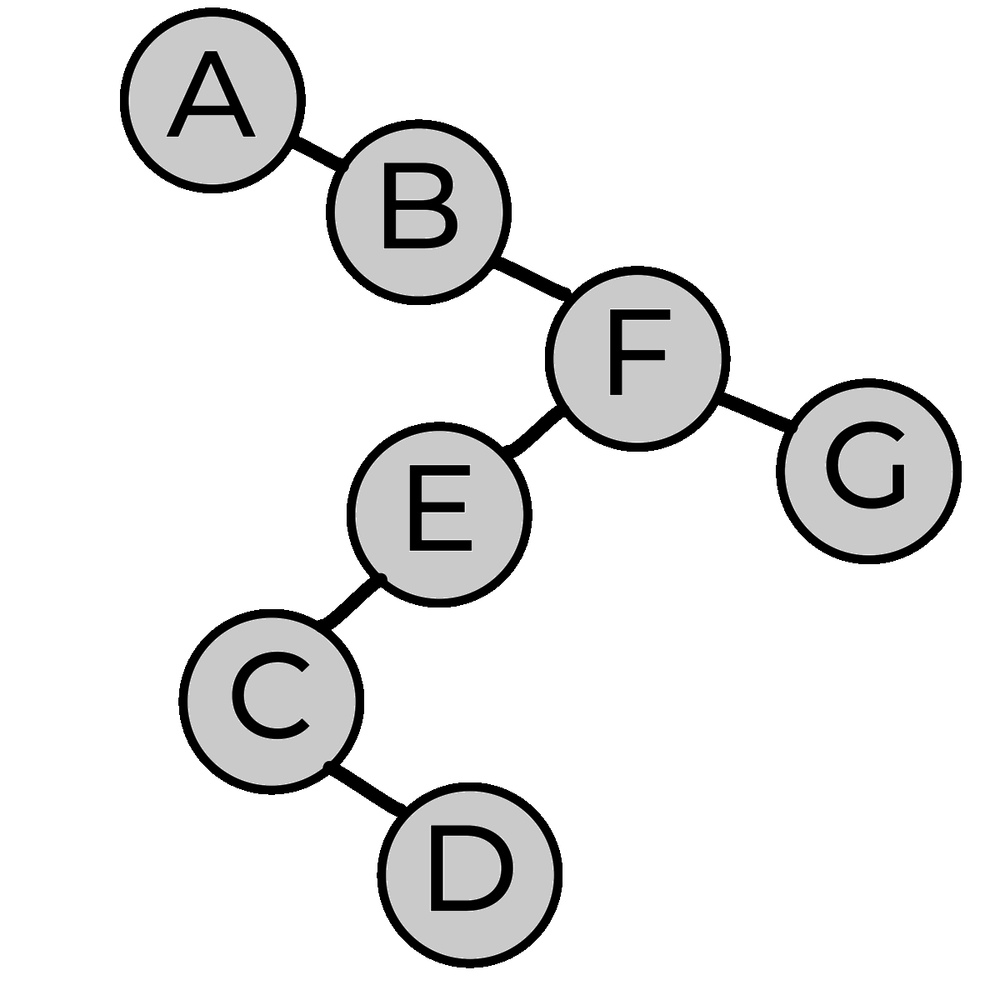
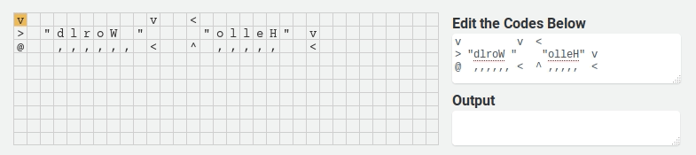
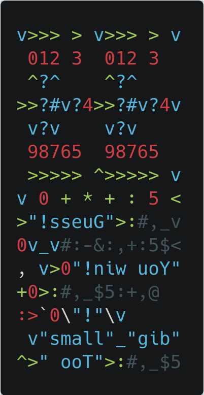
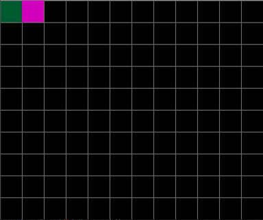
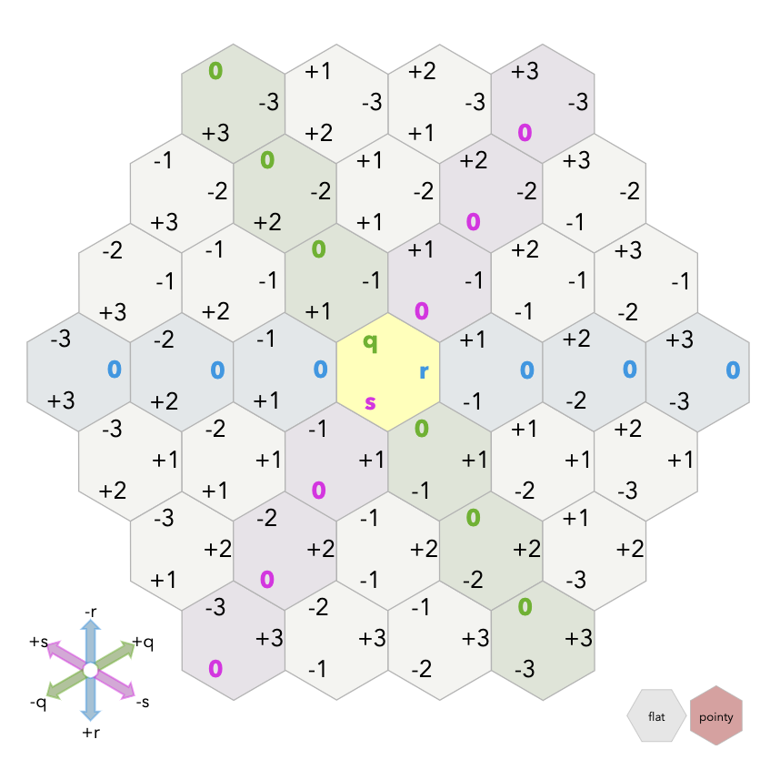
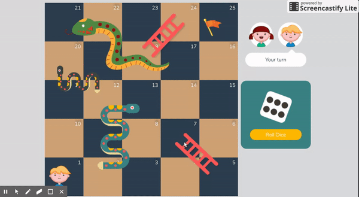
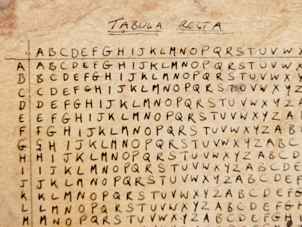

## SudokuSolver


### Task

Implement a Sudoku solver that takes a Sudoku puzzle as input and returns a valid solution.

```py
fn solve(puzzle: string) -> solution: string
```

Assume the input to be in the form of a string containing multiple liens of comma separated values:

```
5, 3, 0, 0, 7, 0, 0, 0, 0
6, 0, 0, 1, 9, 5, 0, 0, 0
0, 9, 8, 0, 0, 0, 0, 6, 0
8, 0, 0, 0, 6, 0, 0, 0, 3
4, 0, 0, 8, 0, 3, 0, 0, 1
7, 0, 0, 0, 2, 0, 0, 0, 6
0, 6, 0, 0, 0, 0, 2, 8, 0
0, 0, 0, 4, 1, 9, 0, 0, 5
0, 0, 0, 0, 8, 0, 0, 7, 9
```

> The empty fields are designated by the invalid value 0.

Prepare comprehensive unit tests.Strive for a unit test coverage of 100% (where sensible.)

#### Minimum Requirements

- Use the **classic Sudoku rules**. [Additional variants](https://en.wikipedia.org/wiki/Sudoku#Variants) are optional.
- Be able to solve **9x9** Sudoku puzzles. Additional sizes are optional.
- Implement at least a [backtracking algorithm](https://en.wikipedia.org/wiki/Sudoku_solving_algorithms#Backtracking). More sophisticated approaches are appreciated.
- Be able to detect invalid/unsolvable puzzles.

---

### Useful Web-Links:

- [Wikipedia | SudokuLink](https://en.wikipedia.org/wiki/Sudoku)
- [Wikipedia | Sudoku Solving AlgorithmsLink](https://en.wikipedia.org/wiki/Sudoku_solving_algorithms)
- [NUnit unit-testing frameworkLink](https://nunit.org)
- [NUnit InstallationLink](https://docs.nunit.org/articles/nunit/getting-started/installation.html)
- [Unit test your code | MSDNLink](https://docs.microsoft.com/en-us/visualstudio/test/unit-test-your-code?view=vs-2022)

---

### Data Driven Unit Tests

```csharp
[TestCase(-1)]
[TestCase(0)]
[TestCase(1)]
public void ReturnFalseGivenValuesLessThan2(int value)
{
    var result = _primeService.IsPrime(value);

    Assert.IsFalse(result, $"{value} should not be prime");
}
```

```csharp
[DataTestMethod]
[DataRow(-1)]
[DataRow(0)]
[DataRow(1)]
public void ReturnFalseGivenValuesLessThan2(int value)
{
    var result = _primeService.IsPrime(value);

    Assert.IsFalse(result, $"{value} should not be prime");
}
```

Sources:

- [Nunit](https://docs.microsoft.com/en-us/dotnet/core/testing/unit-testing-with-nunit)
- [MsTest](https://docs.microsoft.com/en-us/dotnet/core/testing/unit-testing-with-mstest)

## SplayTree



A **splay tree** is a [binary search tree](https://en.wikipedia.org/wiki/Binary_search_tree) with the additional property that recently accessed elements are quick to access again. All normal operations on a binary search tree are combined with one basic operation, called *splaying*.

Splaying the tree for a certain element rearranges the tree so that the element is placed at the root of the tree. One way to do this with the basic search operation is to first perform a standard binary tree search for the element in question, and then use [tree rotations](https://en.wikipedia.org/wiki/Tree_rotation) in a specific fashion to bring the element to the top.

Displays the search algorithm of the splay tree.

---

### Task

Provide at least the following functionality:

Implement a **splay tree** for storing integer values

- `# insert a new value into the treefn insert(value: int)`
- `# remove a value from the tree# returns the count of removed valuesfn remove(value: int) -> int`
- `# remove all values from the treefn clear()`
- `# return the total number of stored valuesfn count() -> int`
- `# find the smallest value stored in the treefn minimum() -> int`
- `# find the largest value stored in the treefn maximum() -> int`
- `# return the number of occurances of a specific valuefn count(value: int) -> int`
- `# check for the occurance of a specific valuefn contains(value: int) -> bool`
- `# traverse the tree pre-order, in-order (default) or post-orderfn traverse(order: OrderEnum) -> list«int»`

Prepare comprehensive unit tests.Strive for a unit test coverage of 100% (where sensible.)

#### Bonus Tasks

- Implement a generic tree that can store different data types with a defined order relation.
- Implement `traverse` in an iterative fashion.
- Visualize the tree (or even the rotations)

---

### Useful Web-Links

- [Splay Tree | WikipediaLink](https://en.wikipedia.org/wiki/Splay_tree)
- [Splay Tree VisualizationLink](https://www.cs.usfca.edu/~galles/visualization/SplayTree.html)

## Befunge Interpreter



### Task

Write an **interpreter** for the esoteric language **Befunge-93**. The interpreter must accept valid Befunge-93 programs, handle user input and print output.

> **Befunge** is a stack-based, reflective, esoteric programming language. It differs from conventional languages in that programs are arranged on a two-dimensional grid.
> "Arrow" instructions direct the control flow to the left, right, up or down, and loops are constructed by sending the control flow in a cycle.



#### Bonus Tasks

- Visualize the execution of the program
- Let the user step through individual steps
- Display the contents of the current stack
- Allow interactive editing of the program

### Useful Web-Links

- [Befunger | Interactive InterpreterLink](https://amicloud.github.io/fungide/)
- [Befunge Doku](https://github.com/catseye/Befunge-93/blob/master/doc/Befunge-93.markdown)
- [Befunge-93 SpecificationLink](https://github.com/catseye/Befunge-93/blob/master/doc/Befunge-93.markdown)
- [Example programsLink](https://github.com/catseye/Befunge-93/tree/master/eg)

## Maze Generator



### Task

Generate a sigma (hexagonal) maze of arbitrary size using Wilson's algorithm.

```
fn generate(width: int, height: int) -> Maze
```

**Visualize** the maze in a way of your choosing

Prepare comprehensive unit tests.Strive for a unit test coverage of 100% (where sensible.)

#### Bonus Tasks

- Visualize the generation of the maze
- Support different maze and/or room shapes

---

### Hexagon Grid

To generate hexagon’s you need to work with axial coordinates (q, r, s).

> Hexagons are 6-sided polygons. *Regular* hexagons have all the sides the same length. I'll assume all the hexagons we're working with here are regular. The typical orientations for hex grids are vertical columns (**flat topped**) and horizontal rows (**pointy topped**).
>
> Hexagons have 6 sides and 6 corners. Each side is shared by 2 hexagons. Each corner is shared by 3 hexagons. For more about centers, sides, and corners, see [my article on grid parts](http://www-cs-students.stanford.edu/~amitp/game-programming/grids/) (squares, hexagons, and triangles).



[Full article here!](https://www.redblobgames.com/grids/hexagons/)

---

### Wilson’s Maze Algorithm

> Wilson’s algorithm uses [loop-erased random walks](http://en.wikipedia.org/wiki/Loop-erased_random_walk) to generate a uniform [spanning tree](http://en.wikipedia.org/wiki/Spanning_tree) — an unbiased sample of all possible spanning trees. Most other maze generation algorithms, such as [Prim’s](https://bl.ocks.org/mbostock/11159599), [random traversal](https://bl.ocks.org/mbostock/70a28267db0354261476) and [randomized depth-first traversal](https://bl.ocks.org/mbostock/1ef3b1fb9eb35ca8ffff), do not have this beautiful property.
>
> The algorithm initializes the maze with an arbitrary starting cell. Then, a new cell is added to the maze, initiating a random walk (shown in magenta). The random walk continues until it reconnects with the existing maze (shown in white). However, if the random walk intersects itself, the resulting loop is erased before the random walk continues.
>
> Initially, the algorithm can be frustratingly slow to watch, as the early random walks are unlikely to reconnect with the small existing maze. However, as the maze grows, the random walks become more likely to collide with the maze and the algorithm accelerates dramatically.
>
> Source: https://bl.ocks.org/mbostock/11357811

**_The algorithm goes something like this:_**

1. Choose any vertex at random and add it to the UST.
2. Select any vertex that is not already in the UST and perform a random walk until you encounter a vertex that is in the UST.
3. Add the vertices and edges touched in the random walk to the UST.
4. Repeat 2 and 3 until all vertices have been added to the UST.

## Monte Carlo Simulation



### Task

Simulate individual games of *Snakes and Ladders* using a **Monte Carlo Simulation**.

- Allow for variably sized boards, different distributions of snakes and ladders, and various die sizes.
- Determine the average number of moves needed for a single player to reach the end.
- Record the lowest number of moves and its die rolls.

- Prepare comprehensive unit testsStrive for a unit test coverage of 100% (where sensible).

#### Bonus Tasks

- Run simulations in parallel
- Allow for non-uniformly distributed die-rolls.
- Plot the results of your simulations.
- Compare your results to the expected number of moves provided by the fundamental matrix of the corresponding absorbing Markov Chain.

---

### Useful Web-Links

- [Snakes and Ladders | Wikipedia](https://en.wikipedia.org/wiki/Snakes_and_ladders)

  > Any version of Snakes and Ladders can be represented exactly as an [absorbing Markov chain](https://en.wikipedia.org/wiki/Absorbing_Markov_chain), since from any square the odds of moving to any other square are fixed and independent of any previous game history. 
  > The Milton Bradley version of *Chutes and Ladders* has 100 squares, with 19 chutes and ladders. A player will need an average of 39.2 spins to move from the starting point, which is off the board, to square 100. A two-player game is expected to end in 47.76 moves with a 50.9% chance of winning for the first player. Those calculations are based on a variant where throwing a six does not lead to an additional roll; and where the player must roll the exact number to reach square 100 and if they overshoot it their counter does not move.

- [Markov Chain | WikipediaLink](https://en.wikipedia.org/wiki/Markov_chain)
- [Markov Chain SimulatorLink](https://setosa.io/markov/#%7B"tm"%3A%5B%5B0.5%2C0.5%5D%2C%5B0.5%2C0.5%5D%5D%7D)
- [Analysis of Chutes and LaddersLink](https://www.datagenetics.com/blog/november12011/index.html)
- [Absorbing Markov Chain | WikipediaLink](https://en.wikipedia.org/wiki/Absorbing_Markov_chain)
- [Math.NET NumericsLink](https://numerics.mathdotnet.com)

## Encryption


### Task

- Implement two substitution cipher algorithms to encrypt and decrypt text in the ISO basic Latin alphabet (A-Z):

  - _Chaociper_

    ```
    class Chaocipher:
      lAlphabet: string
      rAlphabet: string
    ```

    ```
      fn encrypt(plaintext: string) -> ciphertext: string
      fn decrypt(ciphertext: string) -> plaintext: string
    ```

  - *Autokey Cipher* (using a tabula recta)

    tabula recta

    ```
      fn encrypt(plaintext: string, primer: string) -> ciphertext: string
      fn decrypt(ciphertext: string, primer: string) -> plaintext: string

    ```

- Prepare comprehensive unit tests

  Strive for a unit test coverage of 100% (where sensible.)

  ***

### Chaocipher

[Full article here!](https://cs.widener.edu/~yanako/html/courses/Fall17/csci391/Chaocipher-Revealed-Algorithm.pdf)
The Chaocipher was invented by J.F.Byrne in 1918 and, although simple by modern cryptographic standards, does not appear to have been broken until the algorithm was finally disclosed by his family in 2010.

### Autokey Cipher

[Full article here!](https://en.wikipedia.org/wiki/Autokey_cipher)

> The autokey cipher, as used by members of the American Cryptogram Association, starts with a relatively-short keyword, the *primer*, and appends the message to it. If, for example, the keyword is `QUEENLY` and the message is `attack at dawn`, the key would be `QUEENLYATTACKATDAWN`.

```
Plaintext:  attackatdawn...
Key:        QUEENLYATTACKATDAWN....
Ciphertext: QNXEPVYTWTWP...
```


