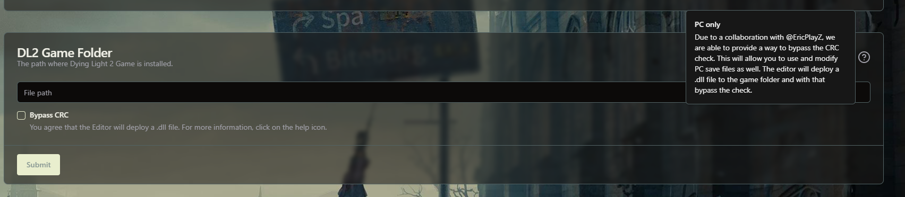
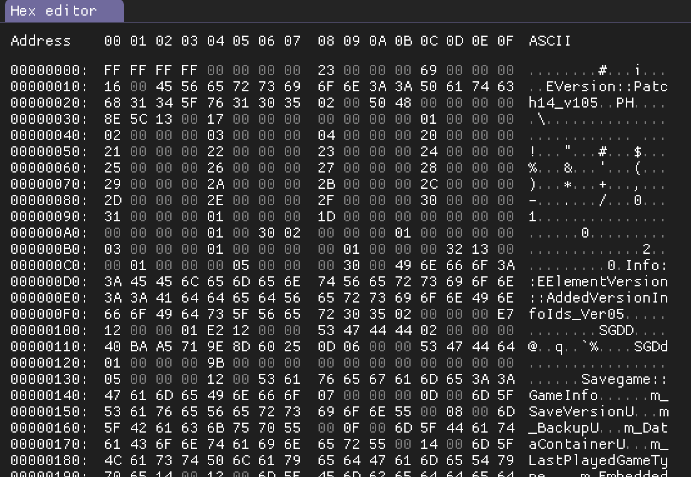

## Why can't I click on some of the icons in the menu?

Some Icons are disabled because those features are not implemented yet.

## Is the Editor for PC?

Yes, since the release of 1.0.8 the Editor also supports PC. Since PC saves are locked with CRC checks, a collaboration with @EricPlayZ has allowed this project to overcome this issue. If you want to load an edited save on PC, you have to allow the editor to add the CRC Bypass `.dll` to your gamefiles.

> Ensure that the file path points to the source of your game `Dying Light 2\ph\work\bin\x64`.

## Why is my save not loading?

There are certain prerequisites in order to edit the save:

- Firstly you have to check if your save is decrypted if you are on PS4:
    - PS4 savefiles are always encrypted. With the help of Savewizard/Apollo or similar Bot-Services you have to decrypt and extract your save file
    - PC savefiles are always compressed and you have to decompres it with extract-Applications like gzip
- To test if you decrypted/decompressed it correctly you could right click on your save and open with your desired hex editor (For example [HxD](https://mh-nexus.de/de/hxd/) or [ImHex](https://github.com/WerWolv/ImHex)). The content should look something like this (The ASCII text should contain readable bits like `Savegame`, etc):

> A Visual Representation of how a Hex Editor Looks

- There are currently some issues with the transmog system that might cause issues for the inventory editor.
- If the save is still not loading, feel free to ask for help.

## What seed should I use?

As explained inside [Tutorial](notion://www.notion.so/marcel-to/Tutorial#how-to-edit-inventory-items) the seed is used for generating the stats for an item. But since a seed generates random stats, we have no choice but to experiment with random seeds until we find better ones. Currently there are 2 community favorites. One for weapons and one for armour.

- The legendary stats seed for weapons. It contains 12 different stats in total:
    - Level: `5519`
    - Seed: `22352`
- The "godmode" armor. It has nearly max damage resistance and on top of that very good stamina cost reduction.
    - Level: `4096`
    - Seed: `60184`
