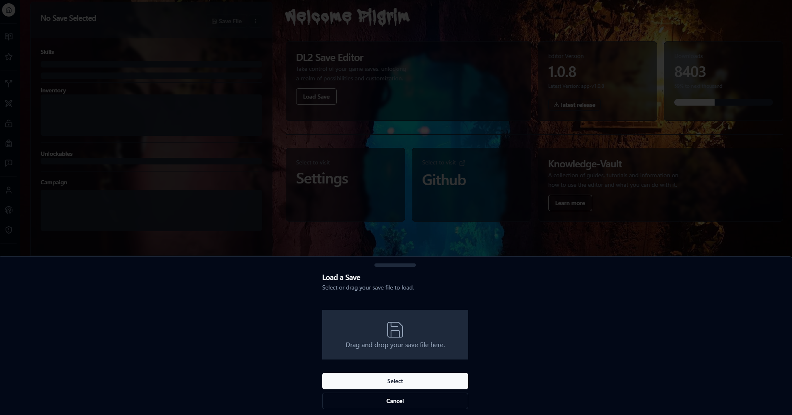
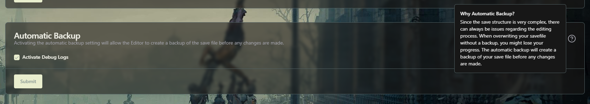
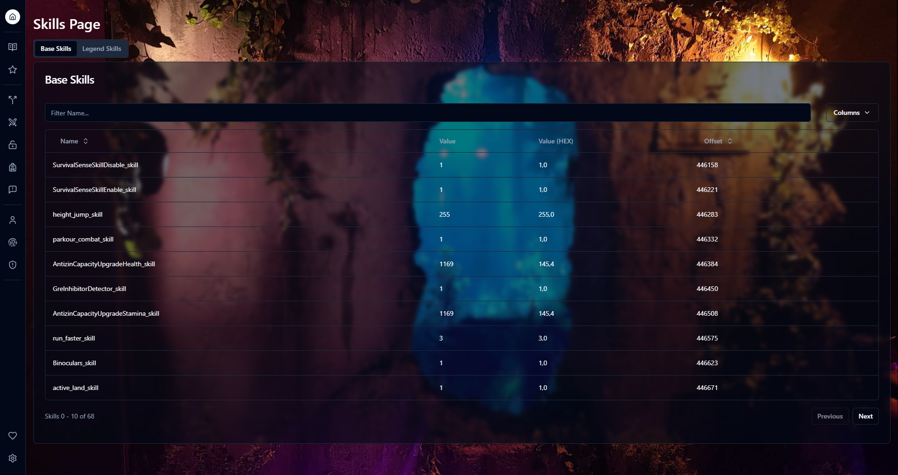
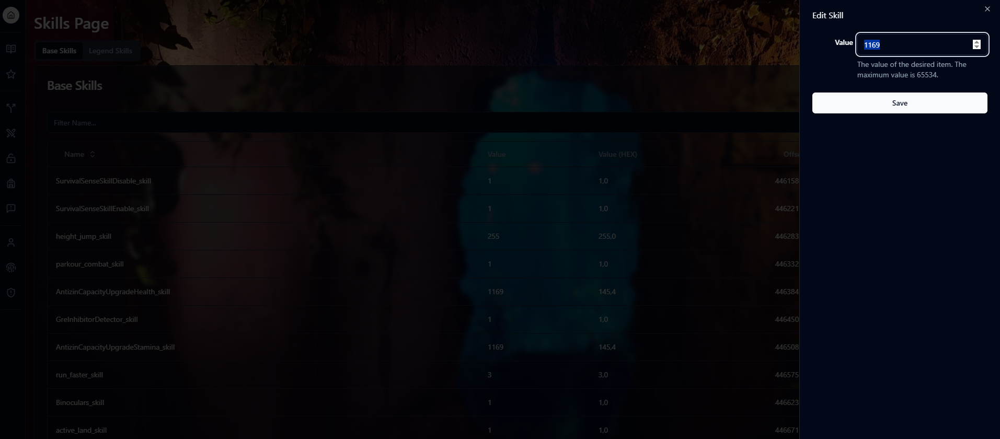
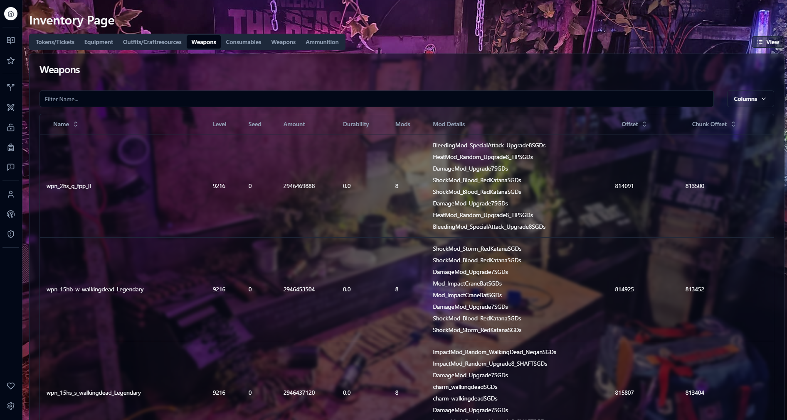
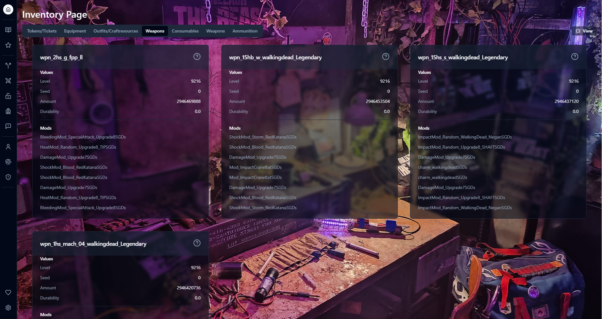
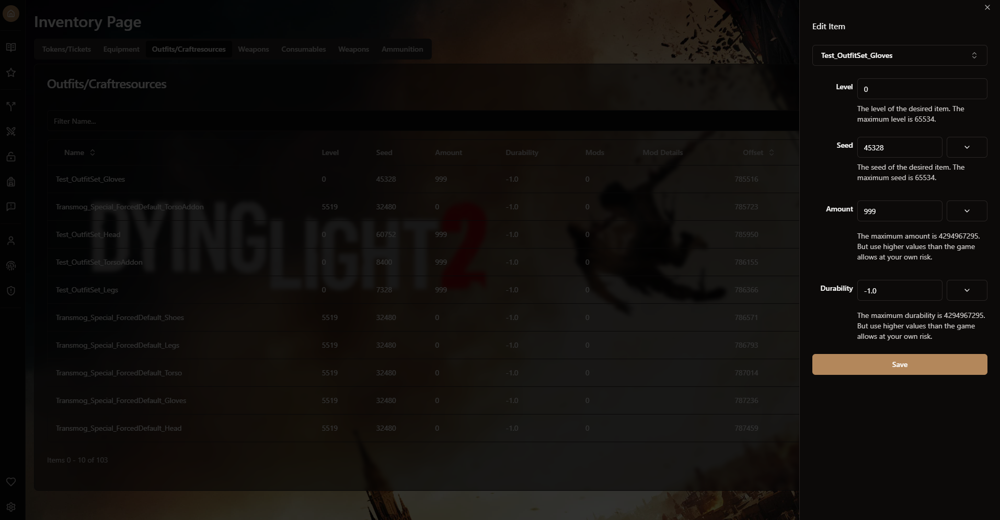
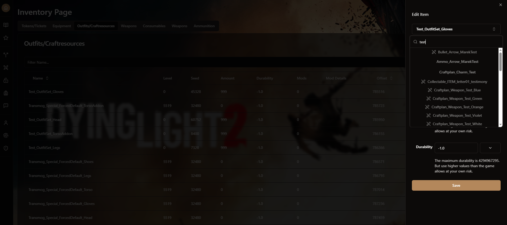

import Callout from '@/components/Callout.astro'

If you find yourself overwhelmed or struggling with the editor, than this page is for you. In the following steps we will explain the use and features of the editor in detail.

<Callout title="Outdated ID matching algorithm" variant="problem">
The current release does have an outdated ID matching algorithm, due to the changes made by techland. It does not account for the IDs added by the transmog system. That is the reason why some saves have issues with the inventory items

A fix for this is in the works for a while now, but it will take a while to reach a satisfying coverage of various different chunk possibilities.

</Callout>

## How to load the save?

On the main page you find a button called `Load Save`. After clicking on it you can choose between drag&drop or selecting a file. If the save is valid, the save information that is displayed on the page like for example the path or the size will change to the current selected file after finishing the validation process.


> If for any reason the information is not displayed, please visit the QnA for help.

## How to do backups of my save?


When loading up a save, the editor by default will automatically create a backup file (For example: `save_main_0.sav.bak`). Even though it generates automatically, it is always a good idea to not overwrite your current save directly. If you prefer to not automatically backup your save, you can change it inside the settings.

## How to edit skills?

When visiting the skills page, a list of your base and legendary skills should be visible


> Skills Page

Clicking on one of the skills allows you to change the value inside the input field. After clicking on `Change`, skill will be edited with the new input value.


> Skill Item change Example

## How to edit inventory items?

When visiting the inventory page, a bunch of tabs will be displayed depending on the amount of various stuff you have in your inventory.

<div class="flex flex-wrap justify-center gap-4 [&_img,p]:m-0">
  <div class="max-w-xs">
    
  </div>
  <div class="max-w-xs">
    
  </div>
</div>

Selecting one of the items will give you the option to edit various data of the item like

```
level, seed, amount, durability
```


> Selecting an inventory item

The level is not displayed like `1-13`, but rather in a u16 integer value, for example: `6543`.

The seed is used for generating the stats of the items. Each seed generates a specific stat pattern. However the level affects the seed, the highest level Caz uses for the exotic 13 stats is level = 6543. With this level and the following seed `22352` you get the 13 stats with one 75% stat. For legendary 12 stats level is 5519.

If you want to test out random seeds, the editor has a randomize button besides the seed input. Feel free to play around and share your best seed!

It is also possible to change the ID of an item. The ID is used for telling the game, what item you have. So for example if you want to change the item, just click on the edit button on the right of the ID and enter your desired ID. The autocorrect even displays all possible IDs that are able to be swapped. But there is a catch. Because the editor can't currently edit the size of the save, you can only choose IDs that are the same length or less. This is also the reason why you can't just add Items inside the editor yet.


> ID selecting with autocomplete feature
