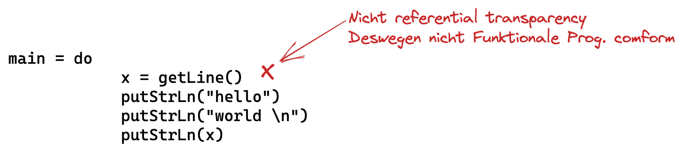
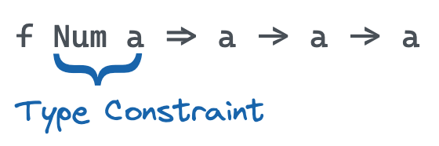
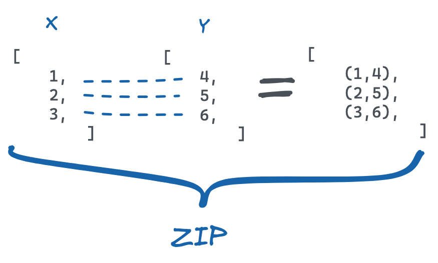
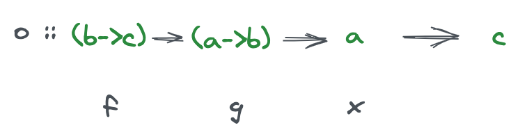
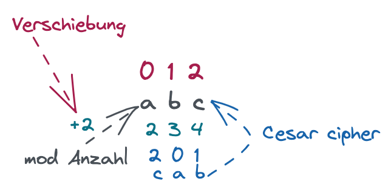

# Haskell

Tags: Haskell, Programming, Programming Language

Sources: http://learnyouahaskell.com/chapters

# Installation

Haskell Installation:
[Downloads](https://www.haskell.org/downloads)

what do I need?:

- Stack
- ghc
- VS Code

# Online Haskell

If online interpreter is needed:
[Haskell Playground](https://play.haskell.org/)

# How to list

```haskell
[ 1, 2, 3 ]

[ 1, 'ab' ]
```

```haskell
{ 2*x | x e N, x ≤ 10 }

[2x | x <- [1, 10], x ≤ 20]
```

Der Abschnitt `x←[1,10]` ist der generierende Part

Der Abschnitt `x ≤ 20` ist der filternde Teil

| Type        | Input    |
| ----------- | -------- |
| Char        | ‘a’      |
| String      | “a”      |
| Int (32bit) |          |
| Double      |          |
| Bool        |          |
| Object      |          |
|             |          |
| List        | \[1, 2\] |
| Tuple       | (1, 2)   |
|             |          |

```haskell
ghci> [1,2,3] ++ [4,5]
[1,2,3,4,5]

ghci> head [1,2,3]
1

ghci> tail [1,2,3]
[2,3]

ghci> 4 : [1,2,3]
[4,1,2,3]

ghci> [1 .. 10]
[1,2,3,4,5,6,7,8,9,10]

ghci> [1,3 .. 10]
[1,3,5,7,9]
```

# Exception Example



# Math Equation examples

How to convert `f(x, y) = x + y + 3`.

```haskell
f x y = x + y + 3
f :: Int -> Int -> Int
-- :: is of type
-- the first Int is for x
-- the second Int is for y
-- the last Int is for the result
```

# Small Exercises

```haskell
import Data.List (group)

-- doubleReverse: abcd -> abcddcba
doubleReverse :: [a] -> [a]
doubleReverse x = x ++ reverse x

-- compr: Kompression "aaabbbcccca" -> [(3,'a'), (3,'b'), (4,'c'), (1,'a')]
compr :: Eq a => [a] -> [(a, Int)]
compr = map (\y -> (head y, length y)) . group

-- ggt: Größter gemeinsamer Teiler
ggt :: Integer -> Integer -> Integer
ggt a 0 = a
ggt a b = ggt b (a `mod` b)

factors :: Integer -> [Integer]
factors n = [x | x <- [2 .. n - 1], n `mod` x == 0]

-- filterAdjacent: Filter einer Liste, wobei Element nur erhalten bleibt, wenn ident mit nachfolgendem, "abbbccd" -> "bbc"
filterAdjacent :: Eq a => [a] -> [a]
filterAdjacent = (init =<<) . group

-- isPal: Test auf Palindrom (Variante ohne Verwendung von reverse)
isPal :: Eq a => [a] -> Bool
isPal x = x == reverse x
isPal' x = x == foldl (flip ( : )) [] x

-- isPrime: Test auf Primzahl
isPrime :: Integer -> Bool
isPrime n = n > 1 && null (factors n)

-- isPowOfTwo: Test ob Zahl Potenz von 2 ist.
isPowOfTwo :: Integer -> Bool
isPowOfTwo 1 = True
isPowOfTwo x
    | x < 1 = False
    | (x `mod` 2) /= 0 = False
    | x >= 2 = isPowOfTwo (x `div` 2)

-- kgv: Kleinstes gemeinsames Vielfaches
kgv :: Integer -> Integer -> Integer
kgv _ 0 = 0
kgv 0 _ = 0
kgv x y = abs ((x `quot` gcd x y) * y)

-- listPrime: Zwei Zahlen als Eingabe, alle Primzahlen dazwischen als Ausgabe
listPrime :: Integer -> Integer -> [Integer]
listPrime l u = [x | x <- [l .. u], isPrime x]

-- primFaktorZerlegung: Ausgabe Liste von Tupel mit (Faktor, Anzahl), 144 -> [(2,4),(3,2)]
primFaktorZerlegung :: Integer -> [(Integer, Int)]
primFaktorZerlegung = compr . primeFactors

primeFactors n =
    case factor of
        [] -> [n]
        [f] -> factor ++ primeFactors (n `div` f)
    where factor = take 1 $ factors n

-- sums: [Int] -> [Int], n-te Zahl der Ausgabe = Summe der letzten n Zahlen der (endlichen) Eingabe, [1..5] -> [5,9,12,14,15]
sums :: [Integer] -> [Integer]
sums = scanl1 (+) . reverse
```

# GHCI Terminal

## Imports

```haskell
import Data.Map

import Data.Map as M
ghci> M.map

import qualified Data.Map as M
```

## Verschiedene Funktionsaufruf Möglichkeiten

```haskell
ghci> div 3 2
1
ghci> 3 'div' 2
1
ghci> (div) 3 2
1
```

## Check Typ von Funktion

```haskell
ghci> f x = 2*x
ghci> :type f -- :t or :type
f :: Num a => a -> a
```

## Verzweigung - If/else

```haskell
ghci> f x = if x > 2 then ">2" else "<=2"
ghci> :t f
f :: (Ord a, Num a) => a -> String
```

```haskell
ghci> f x = 2*x
ghci> f (if (f 2) > 3 then 1 else 3)
2
ghci> f 1
2
```

## Index

```haskell
ghci> :t (!!)
(!!) :: [a] -> Int -> a
ghci> (!!) [5,2,7] 0
5
ghci> (!!) [5,2,7] 2
7
```

## Ordering - Compare

```haskell
ghci> compare 3 2
GT -- Greater Than

ghci> compare 2 2
EQ -- Equal

ghci> compare 1 2
LT -- Lesser Than
```

## Type Constraints

To display a type constraint in Haskell, you can use the `::` operator.
For example, if you want to define a function `add` that takes two `Int`
arguments and returns an `Int`, you would write:

```haskell
add :: Int -> Int -> Int
add x y = x + y
```

In this example, `::` is used to specify that `add` takes two `Int`
arguments and returns an `Int`.

To specify a specific interface in a generic function:



## maxBound

```haskell
ghci> maxBound
()

ghci> maxBound :: Int
9223372036854775807

ghci> maxBound :: Char
'\1114111'

ghci> maxBound :: Ordering
GT
```

## Convert to String - show

```haskell
ghci> show 3
"3"

ghci> show [3]
"[3]"

ghci> show ['a', 'b']
"\"ab\""

ghci> putStrLn $ show "ab"
"ab"
```

## Convert from String - read

```haskell
ghci> :t read
read :: Read a => String -> a

ghci> read "3"
*** Exception: Prelude.read: no parse -- Wirft exception, weil nicht weiß welcher Datentyp es werden soll.

ghci> read "3" :: Int
3

ghci> read "True" :: Bool
True
```

## map

```haskell
ghci> :t map
map :: (a -> b) -> [a] -> [b]

ghci> map show [1,2,3]
["1", "2", "3"]

ghci> map (const 1) [1,2,3]
[1,1,1]

ghci> f x = x + 1

ghci> map f [1,2,3]
[2,3,4]

ghci> map (\x -> x * 2 + 1) [1,3,5]
[3,7,11]
```

```haskell
ghci> mymap f xs = foldr (\x acc -> f x : acc) [] xs

-- Point freestyle
ghci> mymap f = foldr ((:) . f) []

ghci> mymap succ [1,2,3]
```

## Filtering - filter

for

```haskell
ghci> :t filter
filter :: (a -> Bool) -> [a] -> [a]

ghci> f x = x < 5

ghci> filter f [1 .. 10]
[1,2,3,4]
```

# Load Files

First create a txt. file and create a code snippet:

```haskell
-- displays recursive function
f 0 = 0
f x = 1 + f(x - 1)

-- shows an sum function with an unknown length list
mysum [] = 0
mysum (x:xs) = x + mysum xs

-- ---------------------------------------------------------- --
-- own Maximum example with recursive check.
mymax x y if x < y then y else x

mymaximum [] = error "will nicht"
mymaximum [x] = x
mymaximum (x:xs) = mymax x (mymaximum xs)
```

Then go to a terminal, go to the correct path and open `ghci`.

```haskell
ghci> :load file.hs
[1 of 1] Compiling Main             ( file.hs, interpreted )
Ok, one module loaded.

ghci> mymaximum [2,5,3,6,7,1]
7
```

## Zip



```haskell
-- Catching Empty Lists
myzip [] _ = []
myzip _ [] = []

myzip (x:xs) (y:ys) = (x,y):myzip xs ys
```

## Quicksort

Here’s an implementation of the quicksort algorithm in Haskell:

    myquicksort [] = []
    myquicksort (x:xs) = myquicksort (filter (< x) (x:xs)) ++ [x] ++ myquicksort (filter (> x) (x:xs))

This implementation sorts a list in ascending order.

## Function application with \$

```haskell
f $ x = f x

ghci> map (+) [1,2,3]
[1+,2+,3+]

ghci> map ($ 1) [1,2,3]
[2,3,4]
```

$ ermöglicht bessere Übersicht bei verketteten Abfragen

$$
succ(succ(abs(-3))) == succ\$succ\$abs(-3)
$$

```haskell
ghci> sum (filter (>10) (map (*2) [2..10]))

ghci> sum $ filter (>10) $ map (*2) $ [2..10]

ghci> f => \x -> sum $ filter (>10) $ map (*2) X
ghci> f [2..10]
80
```

## Function composition (.)

$$
(f \circ g) x = f(g(x))
\newline
(f \circ g \circ h)x = f(g(h(x)))
$$



```haskell
ghci> f = sum . filter (>10) . map (*2)
ghci> f [2..10]
80
```

```haskell
ghci> map (\x -> negate (abs x)) [...]

ghci> map (\x -> negate . abs $ x) [...]

ghci> map (negate . abs) [...]

-- ------------------------------------
ghci> map (\xs -> negate (sum (tail xs))) [...]

ghci> map (\xs -> negate . sum(tail xs)) [...]

ghci> map (\xs -> negate . sum . tail $ xs) [...]

ghci> map (negate . sum . tail) [...]

-- ------------------------------------
ghci> f = sum (takeWhile (<10000) (filter odd (map (^2) [1..])))

ghci> f = sum (takeWhile (<10000) (filter odd . map (^2) $ [1..]))

ghci> f = sum (takeWhile (<10000) . filter odd . map (^2) $ [1..])

ghci> f = sum . takeWhile (<10000) . filter odd . map (^2) $ [1..]
```

## Negate

```haskell
ghci> negate . (* 3) $ 2
-6
ghci> negate . (* 3) 2
-6
ghci> negate $ (* 3) $ 2
-6
ghci> negate ( (* 3) 2 )
-6
ghci> negate (2* 3)
-6
```

## My Elem

```haskell
myelem x xs = foldl (\acc x -> if ((x==y) || acc) then True else False) False xs
```

# Cesar Cipher



```haskell
ghci> import Data.Char
ghci> ord 'a'
97

ghci> chr '65'
'A'
```

```haskell
import Data.Char
-- Ascii values 32 >= n < 127

-- encrypt "ein geheimer satz" 2
encrypt :: [Char] -> Int -> String
encrypt []  x = []
encrypt (x:xs) n = shift x n : encrypt xs n

-- decrypt "ein verschlüsselter satz" 2
decrypt :: [Char] -> Int -> String
decrypt x n = encrypt x (negate n)

-- shift 'a' 2 = 'c'
shift :: Char -> Int -> Char
shift x n = chr ((ord x + n) `mod` 127) -- 127 weil es 127 ASCII characters gibt

mapShift n x = chr ((ord x + n) `mod` 127) -- 127 weil es 127 ASCII characters gibt

mapEncrypt [] n = []
mapEncrypt x n = map (mapShift n) x
mapDecrypt x n = map (mapShift (negate n)) x
```

## Monaden

Aufgabe: Input entgegen nehmen, bissl modifizieren und ausgeben

```haskell
-- returns the input text again
ghci> getLine >>= putStrLn

ghci> (getLine >>= putStrLn) >>= \x -> putStrLn "end"

-- getLine selber ohne input
ghci> (return "abc" :: IO String) >>= putStrLn >>= \x -> putStrLn "end"
abc
end

-- falls typ genutzt wird, der nicht gebraucht wird
ghci> putStrLn "hello" >> putStrLn "word"
```

## Return

Return verpackt etwas in einen Datentyp der gerade gebraucht wird

```haskell
ghci> return "abc" :: [String]
```

# Lambda Kalkühl

    λxy . x+y
    λx . (λy . x+y)

    (λx . x+1) 2 = 2+1

    (f o g) (x) = f(g(x))
    o = λfgx -> f(gx)
    o = λfgx.f(gx)

```haskell
ghci> :t (\x y z -> x)
(\x y z -> x) :: p1 -> p2 -> p3 -> p1
```

# Group negative and positive

```haskell
ghci> import Data.List
ghci> let values = [-4.3,-2.4,-1.2,0.4,2.3,5.9,10.5,29.1,5.3,-2.4,-14.5,2.9,2.3]
ghci> groupBy (\x y -> ((x >= 0) && (y >= 0)) || ((x < 0) && (y < 0))) values
[[-4.3,-2.4,-1.2],[0.4,2.3,5.9,10.5,29.1,5.3],[-2.4,-14.5],[2.9,2.3]]

-- vereinfachung
ghci> groupBy (\x y -> ((x >= 0) == (y >= 0))) values
[[-4.3,-2.4,-1.2],[0.4,2.3,5.9,10.5,29.1,5.3],[-2.4,-14.5],[2.9,2.3]]

-- vereinfachung mit on
ghci> import Data.Functions
ghci> groupBy ((==) on (>=0)) values
[[-4.3,-2.4,-1.2],[0.4,2.3,5.9,10.5,29.1,5.3],[-2.4,-14.5],[2.9,2.3]]
```

| x   | y   | Result |
| --- | --- | ------ |
| \+  | \+  | True   |
| \+  | \-  | False  |
| \-  | \+  | False  |
| \-  | \-  | True   |

# Network Domain WhoIs

```haskell
import Network.Simple.TCP (connect, send, recv)
import qualified Data.ByteString as BS
import System.IO (hFlush, stdout)

main = do
    putStr "Domain name: "
    hFlush stdout --durch puffern kann der string vllt erst nach getline ausgegeben werden
    domain <- BS.getLine -- returnt bytestring
    connect "whois.nic.at" "43" $ \(socket, _) -> do
        send socket domain
        mbs <- recv socket 4096
        case mbs of
            Nothing -> return()
            Just bs -> BS.putStrLn bs
```
