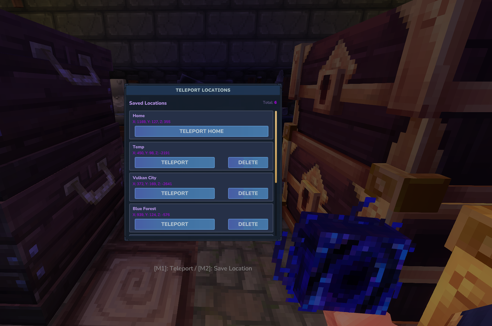
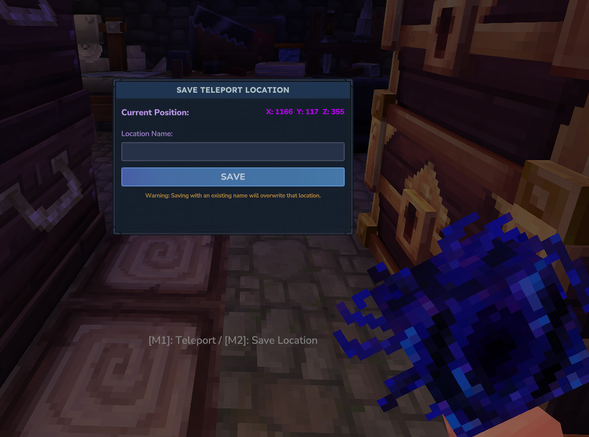

import LinkButton from '@/components/LinkButton.astro'
import Callout from '@/components/Callout.astro'

## Never lose your way back home again.

PortalHome is a mod I created for Hytale. Since coding and gaming is a passion of mine, combining them and creating mods is obviously the next step. Learning how everything works and getting familiar with Java again was quite a task.

<Callout title="Road to Modding Hytale" variant="corollary">

While learning how to mod, I wrote my findings down in a blog post series. You can find the first part of the series here: [Hytale Modding - Part 1](../../blog/road-to-modding-hytale/)

</Callout>

PortalHome introduces the **Pocket Portal**, a legendary mystical artifact that serves as your personal waypoint network in the world of Hytale. This isn't just another teleportation item—it's a full named-location system that lets you bookmark any spot in the world and jump between them instantly. Save as many locations as you need, teleport back to spawn on demand, and manage your waypoints through a clean in-game UI.

### **How It Works**

Hold either interaction for **2.5 seconds** (while standing—crouching blocks activation) to trigger the portal. Blue particles and a custom animation play during the charge-up.

1.  **Hold Primary Interaction (Open Teleport Menu)**: Opens the destination picker, showing your **world spawn point** and every saved named location. Pick any destination and teleport instantly. You can also delete saved locations directly from this screen.

    

2.  **Hold Secondary Interaction (Save Current Location)**: Opens the save menu with your **current coordinates** displayed. Type a custom name and confirm to bookmark the spot for future teleports.

    

A custom **HUD indicator** appears whenever the Pocket Portal is in your hand, so you always know the item is ready.

### **Features**

- **Multi-Location Waypoint System**: Save unlimited named locations and manage them from the teleport menu
- **Spawn Teleport**: Always-available shortcut to your world spawn point—no save required
- **Named Locations**: Every saved waypoint has a custom name and displays its exact coordinates
- **Delete from UI**: Remove waypoints directly from the teleport menu
- **HUD Indicator**: A subtle UI element appears while holding the portal
- **Visual Polish**: Custom 3D model, animations, and blue particle effects during activation
